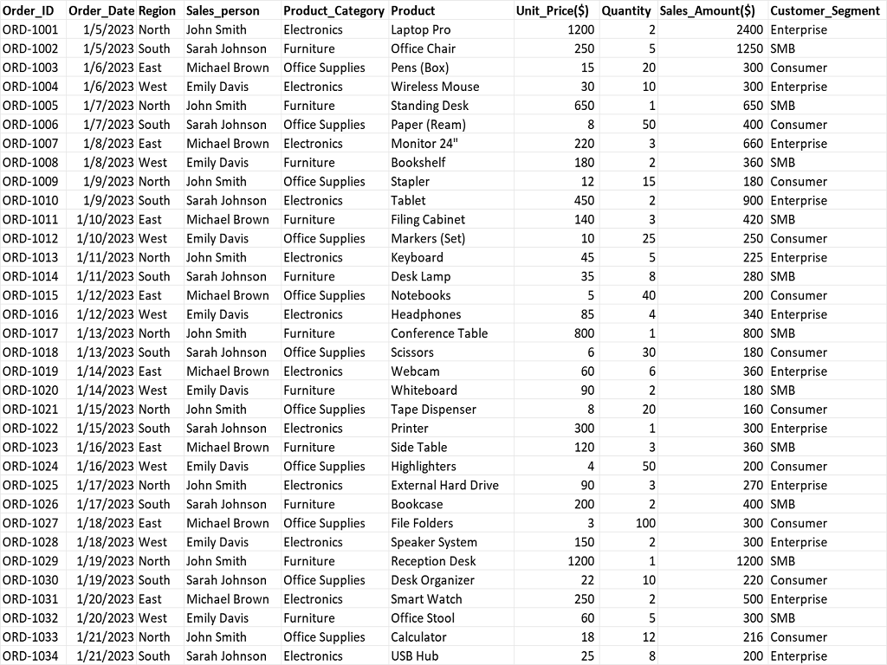
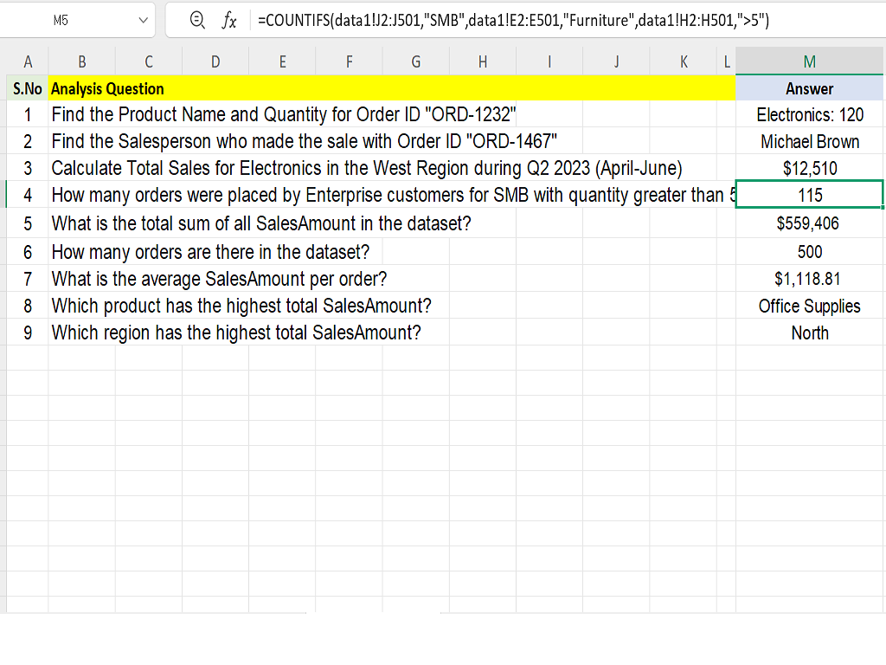
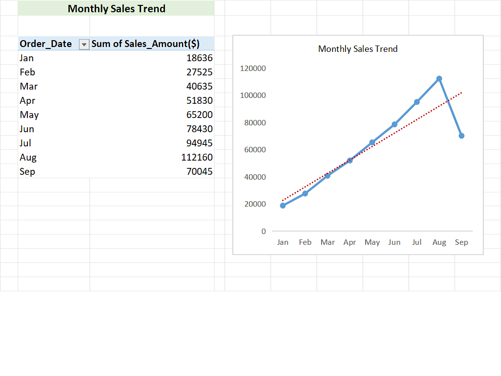
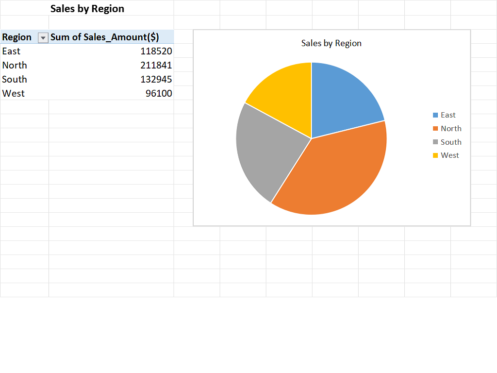
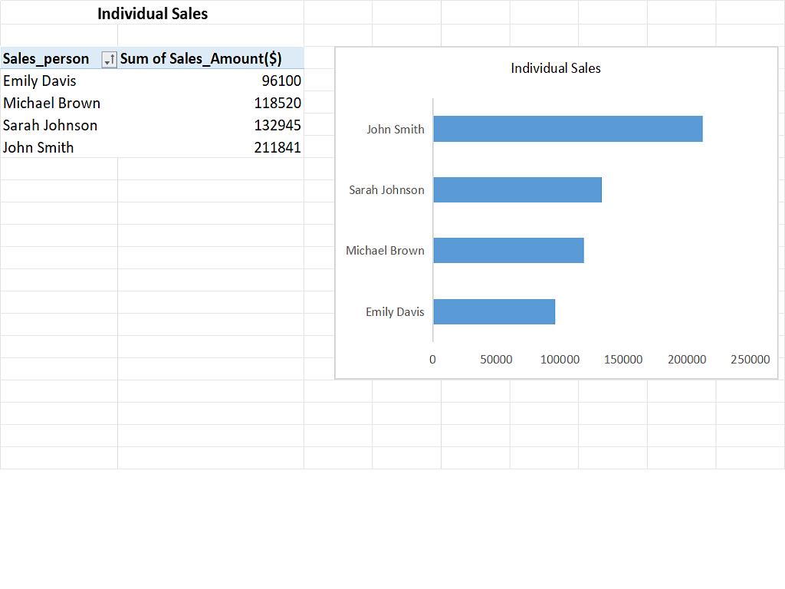

# Regional & Salesperson Revenue Analysis 2023

## Project Overview 

This project is a comprehensive sales performance analytics solution built entirely in Microsoft Excel. It focuses on transforming raw transactional sales data into an interactive dashboard that provides actionable insights into monthly trends, regional effectiveness and individual salesperson productivity.

---

## Project Objectives 
- Analyze sales data by months, region and sales person using pivot tables.
- Calculate KPIs using advanced excel formulas.
- gernerates key insights and visulize it using interactive excel dashboard.

---

## Tools Used
- Excel
- Excel Ribbon Tools
- Excel Formulas & Functions
- Pivot Tables
- Pivot Charts

---

## ## Dataset Information
- **Source:** The data set used in this project was generated using AI for portfolio purpose. All data is synthetic and does not represent real individuals.
- The raw data set has 501 rows including header row and the following ten columns
Order_ID

Order_Date

Region

Sales_person

Product_Category

Product

Unit_Price($)

Quantity

Sales_Amount($)

Customer_Segment

- Type: Sales Analytics

---

## Privacy Notice
- Due to privacy considerations,the complete Excel dataset is not publicly shared. Selected sample screenshots from dataset is provided to demonstrate analysis workflow.

---

**Data set from row 1 to 35**
Screenshot:

## Data Analysis

### Data Analysis using advanced excel formulas:
 
The dataset was analyzed to answer the following business questions using advanced excel formulas

#### Find the Product Name and Quantity for Order ID "ORD-1232".

Found the the Product Name and Quantity for Order ID "ORD-1232" using : TEXTJOIN(": ",TRUE,XLOOKUP("ORD-1232",data1!A2:A501,data1!E2:E501),XLOOKUP("ORD-1232",data1!A2:A501,data1!G2:G501))

XLOOKUP searches for the order number "ORD-1232" in the range data1!A2:A501. It retrieves the corresponding values from column E and column G.

TEXTJOIN combines these two values into a single string, separated by ": ".

The TRUE argument ignores any empty cells.

---

#### Find the Salesperson who made the sale with Order ID "ORD-1467".

Found the Salesperson who made the sale with Order ID "ORD-1467" using : INDEX(data1!D2:D501,MATCH("ORD-1467",data1!A2:A501,0))

MATCH found the position (row number) of "ORD-1467" in column A (range A2:A501). 0 means an exact match.

INDEX fetch the value from column D (range D2:D501) at the row number found by MATCH.

---

#### Calculate Total Sales for Electronics in the West Region during Q2 2023 (April-June)

Calculated the Total Sales for Electronics in the West Region during Q2 2023 (April-June) using : SUMIFS(data1!I2:I501,data1!E2:E501,"Electronics",data1!C2:C501,"West",data1!B2:B501,">="&DATE(2023,4,1),data1!B2:B501,"<="&DATE(2023,6,30))

SUMIFS Found rows where Category = Electronics, Region = West, Date between 1-Apr-2023 and 30-Jun-2023, then sums corresponding I column values.

---

#### How many orders were placed by Enterprise customers for SMB with quantity greater than 5?

Calculated total orders placed by Enterprise customers for SMB with quantity greater than 5 using : COUNTIFS(data1!J2:J501,"SMB",data1!E2:E501,"Furniture",data1!H2:H501,">5")

This formula Counted rows where Column J = SMB, Column E = Furniture, and Column H > 5.

---

#### What is the total sum of all SalesAmount in the dataset?

Computed the total sum of all SalesAmount in the dataset using : SUM(data1!I2:I501)

this formula Sum all values in column I (range I2:I501).

---

#### How many orders are there in the dataset?

Calculated the number of orders in the data set using : COUNTA(data1!A2:A501)

This Formula Count all non-empty cells in column A (range A2:A501).

**Formulas used in answering these business questions**
Screenshot:

---

### What is the average SalesAmount per order?

Calculated the average SalesAmount per order using : AVERAGE(data1!I2:I501)

this formula Calculated the average of all values in column I (range I2:I501).

---

#### Which product has the highest total SalesAmount?

found the product that has highest total sales amount using : =INDEX(data1!E2:E501,MATCH(MAX(SUMIF(data1!E2:E501,data1!E2:E501,data1!H2:H501)),SUMIF(data1!E2:E501,data1!E2:E501,data1!H2:H501),0))

SUMIF(data1!E2:E501, data1!E2:E501, data1!H2:H501) Calculated total values in column H for each unique item in column E.

MAX(...) Find the highest total from the sums calculated in Step 1.

MATCH(MAX(...), SUMIF(...), 0) Find the position of the maximum total within the SUMIF results.

INDEX(data1!E2:E501, MATCH(...)) Retrieve the item name from column E corresponding to the position found in Step 3.

As a result this formula returns the item in column E with the highest total in column H.

---

#### Which region has the highest total SalesAmount?

Found the region that has the highest total SalesAmount using : =INDEX(data1!C2:C501,MATCH(MAX(SUMIF(data1!C2:C501,data1!C2:C501,data1!I2:I501)),SUMIF(data1!C2:C501,data1!C2:C501,data1!I2:I501),0))

SUMIF(data1!C2:C501, data1!C2:C501, data1!I2:I501) Calculated the total of column I for each unique value in column C.

MAX(...) Found the maximum total from Step 1.

MATCH(MAX(...), SUMIF(...), 0) Found the position of the maximum total within the list of SUMIF results.

INDEX(data1!C2:C501, MATCH(...)) Retrieved the region name from column C that corresponds to the maximum total.

As a Result this formula returns the region with the highest total sales in column I.

**Advanced Excel Formula Analysis**
Screenshot:

---

### Data Analysis using Pivot Tables

#### Monthly Sales Trend

This Pivot Table provides a clear and structured view of sales performance over time by summarizing total sales on a monthly basis. 

Analysis Screenshot:

---

#### Sales by Region

This Pivot Table presents a regional breakdown of sales, helping to evaluate performance across different geographic areas.

Analysis Screenshot:

---

#### Indivisual Sales

This Pivot Table provides a detailed analysis of sales performance at the individual salesperson level. It helps evaluate each salesperson’s contribution to overall revenue and supports performance-based decision-making.

Analysis Screenshot:

### Insights Generated

- Sales show a consistent upward trend from January to August, indicating steady business growth.
- The North region contributes the highest share of total sales, making it the top-performing region, suggesting opportunities to balance growth across other regions.
- One salesperson leads with the highest sales, while others have room to improve and boost their performance.

---

## 📊 Dashboard Creation: An excel dashboard was created to summarize insights visually.

The dashboard includes:

- KPIs

- Pivot Charts

- Slicers

---

### Key Performance Indicators (KPIs): The following KPIs were displayed at the top of the dashboard to summarize overall performance:

- Total Orders

- Total Sales

- Average SalesAmount per Order

- Product with the highest Total SalesAmount 

- Region with the highest total SalesAmount

---

### Pivot Charts

Pivot Charts provide a visual representation of Pivot Table data, making it easier to analyze patterns, compare performance, and identify trends. They help transform complex data into clear, interactive insights for better decision-making. the following pivot charts are used

- Monthly Sales Trend

- Sales by Region

- Indivisual Sales

---

### Slicers

Slicers are interactive filters that make analyzing Pivot Table data easy and intuitive. They allow you to quickly filter by categories like Region, Product Category, or Cuustomer Segment, helping you focus on specific insights without altering the underlying data. the following slicers are used

- Region

- Product Category

- Customer Segment

Dashboard Screenshot:

---

