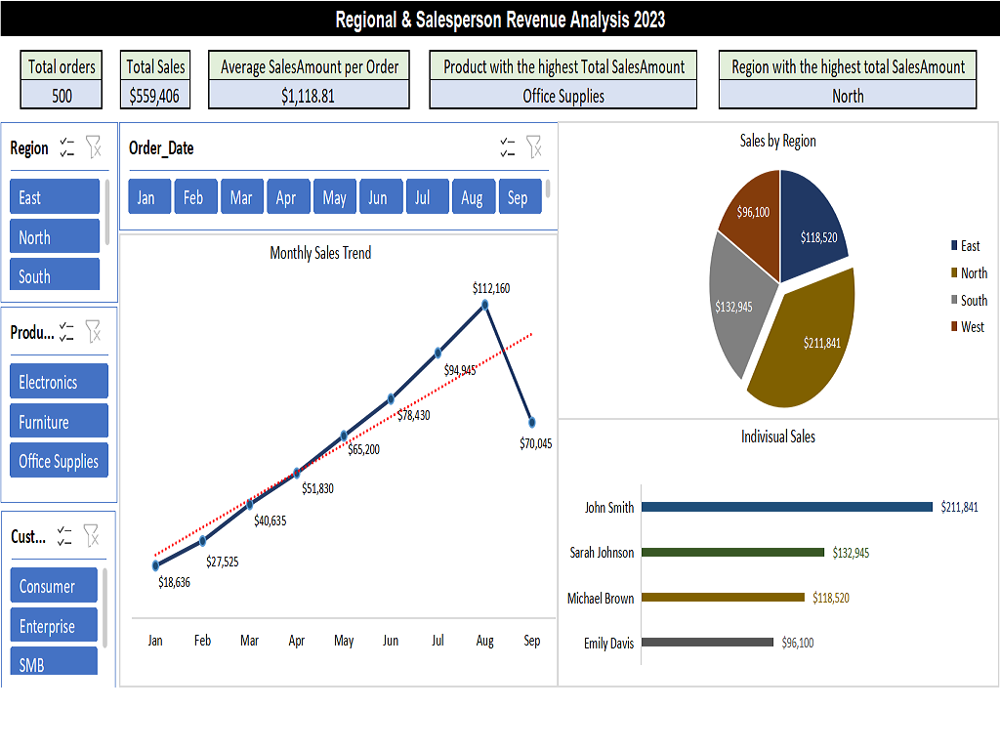

# Regional & Salesperson Revenue Analysis 2023

## Project Overview 
Interactive Excel dashboard analyzing regional and salesperson sales performance to support data-driven revenue and territory decisions.

---

## Table of Contents
1. [Business Problem](#business-problem)
2. [Project Objective](#project-objective)
3. [Dataset](#dataset)
4. [Tools Used](#tools-used)
5. [Workflow](#workflow)
6. [Data Analysis (Advanced Formulas)](#data-analysis-advanced-formulas)
7. [Data Analysis (Pivot Tables)](#data-analysis-pivot-tables)
8. [Dashboard](#dashboard)
9. [Key Insights](#key-insights)
10. [Recommendations](#recommendations)
11. [Repository Structure](#repository-structure)

---
 
## Business Problem
Sales leadership had no consolidated view of **which regions and salespeople were driving revenue** and which were underperforming. Decisions on territory support, incentive design, and resource allocation were being made without a clear, data-backed picture of performance trends.

---

## Project Objectives 
Build an Excel dashboard that lets stakeholders:
- Track monthly sales trends over time
- Compare performance across regions
- Identify top and bottom-performing salespeople
- Filter dynamically by region, product category, and customer segment

---

## ## Dataset Information
- **Source:** Synthetic dataset generated for portfolio purposes. Does not represent real individuals or companies.
- **Size:** 501 rows (500 orders + header), 10 columns
- **Columns:** `Order_ID`, `Order_Date`, `Region`, `Sales_person`, `Product_Category`, `Product`, `Unit_Price($)`, `Quantity`, `Sales_Amount($)`, `Customer_Segment`
- **Type:** Sales transaction data
> **Privacy note:** The full workbook is not shared publicly. Sample screenshots are included below to demonstrate the analysis workflow.

**View Screenshot**

[Data set Preview rows 1_to_35_](Data/screenshot/dataset.png)

---

## Tools Used
- Excel
- Excel Formulas & Functions (XLOOKUP, INDEX/MATCH, SUMIFS, COUNTIFS)
- PivotTables & Pivot Charts
- Slicers (interactive filtering)

---

## Workflow
This project follows a standard analytics lifecycle:
 
```
Raw Data → Data Validation → Formula-Based Analysis → Pivot Table Summarization → Dashboard & Visualization → Insights → Recommendations
```
---

## Data Analysis (Advanced Formulas)
The dataset was used to answer specific business questions using advanced Excel formulas:
 
| Business Question | Technique |
|---|---|
| Find product & quantity for a given Order ID | `XLOOKUP` + `TEXTJOIN` |
| Find salesperson for a given Order ID | `INDEX` + `MATCH` |
| Total sales for Electronics in West region, Q2 2023 | `SUMIFS` with date range |
| Orders by Enterprise customers with quantity > 5 | `COUNTIFS` |
| Total & average sales amount | `SUM`, `AVERAGE` |
| Total number of orders | `COUNTA` |
| Best-selling product | `INDEX` + `MATCH` + `MAX` + `SUMIF` |
| Top-performing region | `INDEX` + `MATCH` + `MAX` + `SUMIF` |
 
**Example — Total Sales for Electronics in West Region, Q2 2023:**
```excel
=SUMIFS(data1!I2:I501,data1!E2:E501,"Electronics",data1!C2:C501,"West",data1!B2:B501,">="&DATE(2023,4,1),data1!B2:B501,"<="&DATE(2023,6,30))
```
`SUMIFS` Found rows where Category = Electronics, Region = West, Date between 1-Apr-2023 and 30-Jun-2023, then sums corresponding I column values.

---

**View Screenshot**

[Advanced Excel Formula Analysis](Analysis/screenshots/Formulas.png)

---

### Data Analysis using Pivot Tables

**Monthly Sales Trend** — summarizes total sales by month to reveal growth patterns. 

**View Screenshot**

[Monthly Sales Trend](Analysis/screenshots/table_1.png)

---

**Sales by Region** — breaks down revenue by geography to compare regional performance.

**View Screenshot**

[Sales by Region](Analysis/screenshots/table_2.png)

---

**Individual Salesperson Performance** — evaluates each rep's contribution to total revenue.

**View Screenshot**

[Individual Salesperson Performance](Analysis/screenshots/table_3.png)

---

## Dashboard
An interactive dashboard consolidates all analysis into a single view:
 
- **KPIs:** Total Orders · Total Sales · Average Sales per Order · Top Product · Top Region
- **Pivot Charts:** Monthly Trend · Sales by Region · Individual Salesperson Performance
- **Slicers:** Region · Product Category · Customer Segment

Dashboard Screenshot:


---

### Insights Generated

- Sales grew consistently from January through August, indicating steady overall business growth.
- The **North region** generates the highest share of total revenue, making it the top-performing territory.
- Performance is uneven across the sales team — one salesperson significantly outperforms the rest.

---

## Recommendations
- **Investigate what's working in the North region** (pricing, customer mix, product focus) and evaluate whether those tactics can be replicated in underperforming regions.
- **Pair top performers with lower-performing salespeople** through mentorship, or review whether territory/account assignment is creating an uneven playing field.
- **Set monthly growth targets** using the observed Jan–Aug trend as a baseline, and monitor via the dashboard's KPI section going forward.

---

## Repository Structure
```
Regional-And-Sales-Person-Analysis/
│
├── Data/
│   └── screenshot/
│       └── dataset.png
│
├── Analysis/
│   └── screenshots/
│       ├── Formulas.png
│       ├── table_1.png
│       ├── table_2.png
│       └── table_3.png
│
├── Dashboard/
│   └── screenshot/
│       └── dashboard.png
│
└── Readme.md
```
---

*This project is part of a data analytics portfolio. See more projects at [github.com/yasirshah-analyst](https://github.com/yasirshah-analyst).*

---

## 👤 Author
 
Yasir Shah | Data Analyst | SQL | Power BI | Excel

- www.linkedin.com/in/yasir-shah-2364183b3
- shahyasir443@gmail.com
